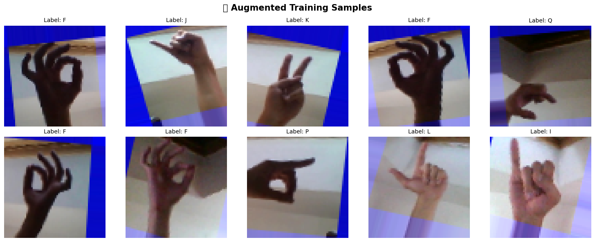
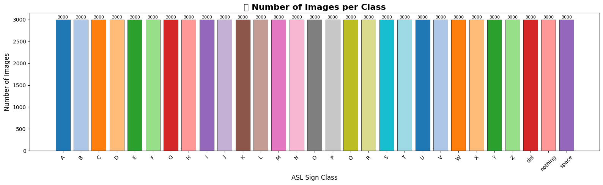
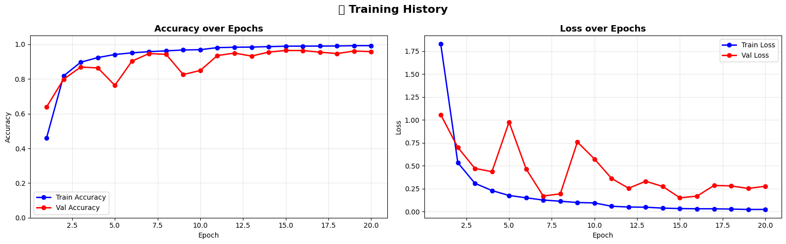
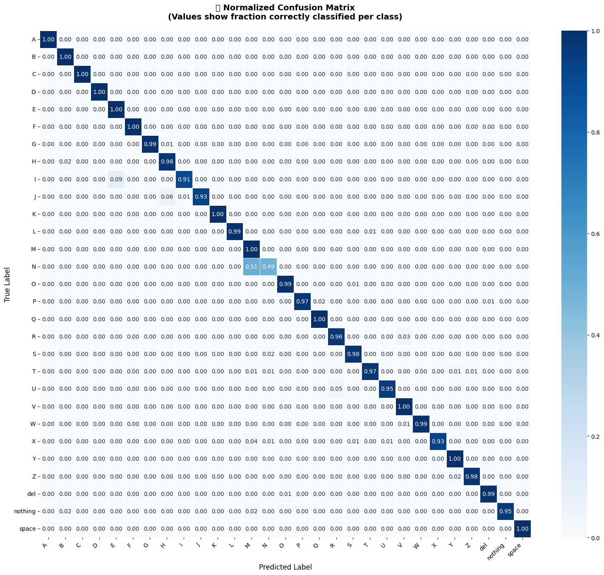
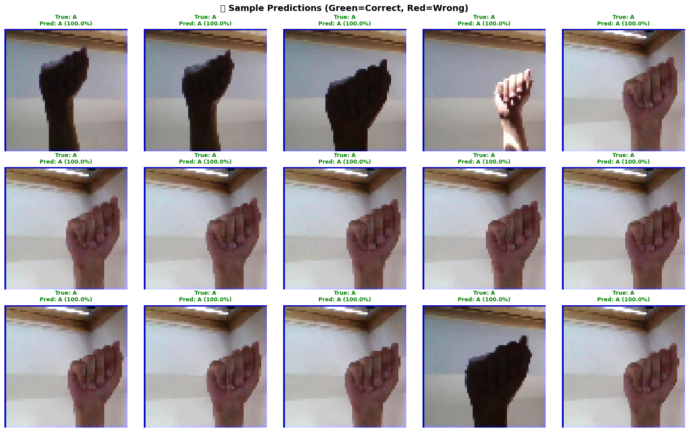

# Sign Language Detection Project

## Overview
This project focuses on building a **Sign Language Detection System** using machine learning techniques. The system is designed to recognize hand gestures corresponding to sign language alphabets and classify them accurately in real-time or from preprocessed data.

The project includes data preprocessing, augmentation, model training, evaluation, and visualization of results.

---

## Features
- Hand gesture recognition using image-based/webcam input
- Data augmentation for improved model generalization
- Performance evaluation using confusion matrix and classification metrics
- Visualization of training performance and predictions

---

## Project Structure

---

## Dataset
The dataset consists of labeled images representing different sign language gestures. Data preprocessing steps include normalization, reshaping, and augmentation.
Kaggle Dataset used: https://www.kaggle.com/datasets/grassknoted/asl-alphabet

---

## Data Augmentation
Data augmentation techniques such as rotation, flipping, and scaling are applied to increase dataset diversity.

---

## Data Distribution
The class distribution of the dataset is visualized below:

---

## Training Performance
The training and validation performance over epochs is shown below:

---

## Evaluation

### Confusion Matrix
The confusion matrix provides insights into classification performance:

---

### Sample Predictions
Example predictions made by the model:

---

---
## Results
- Achieved high accuracy in classifying sign language gestures
- Improved performance through data augmentation and model tuning
- Reliable predictions on unseen test data

---

## Installation

### Prerequisites
- Python 3.x
- Required libraries: numpy, matplotlib, seaborn, scikit-learn, tensorflow / keras, opencv-python